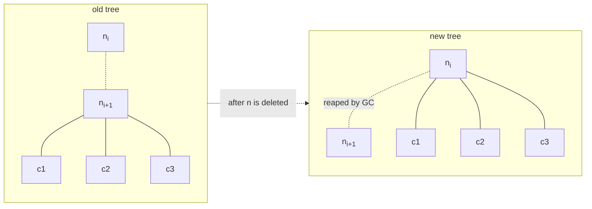

## Problem 1: Delete a node and send its children to its parent

- Given:
  - a tree $T$ (*not necessarily binary*), and
  - some node id `id_num`

- Do:
  - delete the node $n_i$ whose id matches `id_num` by sending all of its children to its parent. $i$ is the tree's depth.

At a glance, we see that we have two scopes to work with: some parent node and its child. We never need to enter the scopes of the grandchildren. In order to relocate them to their new parent/guardian, we only need their references/ids, which can be retrieved from the previous parent.



Now we describe the operation in detail.

Our hypothesis is that there exists some node $n_i$, and among its children is some node $n_{i+1}$ that matches `id_num` in the tree $T$. Because a tree might have many layers (many generations of descendants), we recognize that a recurrence/iteration must exist for such a tree and as long as the break condition is not met.

Now, two cases might happen for each recurrence/iteration. Either the node matches `id_num` or it doesn't.

- Matched: we immediately break the recurrence/iteration and <u>move to the next operation</u>:
    - return the child's id to the parent's scope, and
    - iterate and bind each of its chidren to the new parent.
- Matched **NOT**: we iterate (or *recur depth-first*) through the remainder of the tree until hiting leaf nodes.


Finally, we have the code.

```py
# recursive
def deleteRe(node, id):
    if node.children is None:
        return
    for n in node.children:
        if n.id == id:
            node.remove(n)
            node.insert(n.children)
            return
        deleteIt(n, id)
    return

def delete(root, id):
    if root is None or root.children is None:
        return
    if root.id == id:
        return
    deleteIt(root, id)
```

