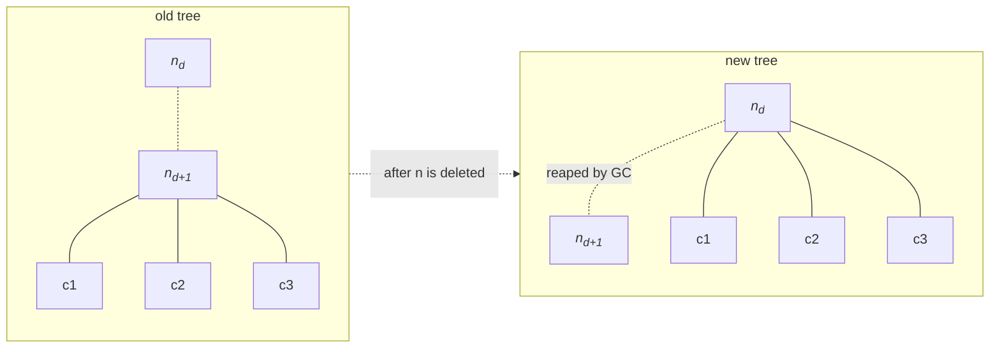

## Problem 1: Delete a node and send its children to its parent

- Given:
  - a tree $T$ (*not necessarily binary*), and
  - some node id `id_num`

- Do:
  - delete some node whose id matches `id_num` by sending all of its children to its parent.

At a glance, we see that we have two lexical scopes to work with: the scope of some parent node $n_d$ and its child $n_{d+1}$. We never need to enter the scopes of the grandchildren. In order to relocate them to their new parent/guardian, we only need their references/ids, which can be retrieved from the former parent $n_{d+1}$.



Now we describe the operation in detail.

#### Our hypothesis is that

> In the tree $T$ there exists some node $n_d$, and among its children there exists some node $n_{d+1}$ whose id matches `id_num`.

#### Our induction is that

> Because a tree might have many layers of depth (many generations of descendants), we recognize that a recurrence must exist for such a tree. This recurrence holds as long as the break condition is not met.
> 
> Now, two cases might happen for each recurrence. Either the node matches `id_num` or it doesn't.
> 
> - Matched: we immediately break the recurrence and <u>move to the next operation</u>:
>     - return the child's id to the parent's scope, and
>     - collect and bind its chidren to the new parent.
> - Matched **NOT**: we iterate (or *recur depth-first*) through the remainder of the tree until hiting leaf nodes.


#### Finally, we implement the algorithm in a language of choice

```py
# recursive
def deleteRe(node, id):
    if node.children is None:
        return
    for n in node.children:
        if n.id == id:
            node.remove(n)
            node.insert(n.children)
            return
        deleteIt(n, id)
    return

def delete(root, id):
    if root is None or root.children is None:
        return
    if root.id == id:
        return
    deleteIt(root, id)
```

