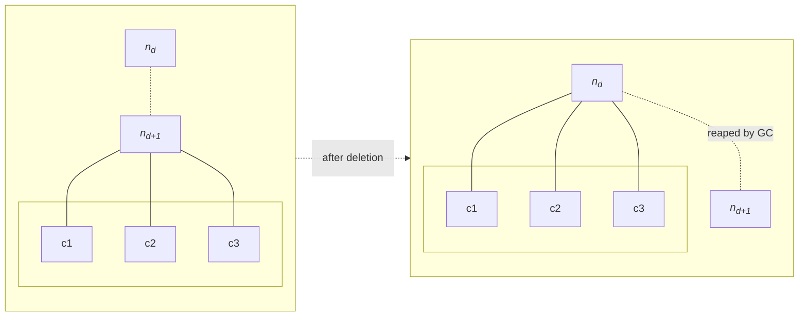

## Problem 1: Delete a node and send its children to its parent

#### We have a problem statement

- Given:
  - a tree $T$ (*not necessarily binary*), and
  - some node id `id`

- Do:
  - delete some node whose id matches `id` and send all of its children to its parent.

#### We first observe that

> We never need to enter the scopes of the orphaned descendants $[c_1..c_n]$. In order to relocate them to their new guardian (namely $n_d$), we only need their id's, which can be retrieved from the former guardian $n_{d+1}$.
>
> Thus, we have two lexical scopes to work with: the scope of some parent node $n_d$ and that of its child $n_{d+1}$. Our goal is to delete $n_{d+1}$ and sends its chidren to the new guardian $n_d$.



#### Our hypothesis is that

> In the tree $T$ there exists some node $n_d$, and among its children there exists some node $n_{d+1}$ whose id matches `id`.


#### We induce our reasoning as follows

> First, we assume that $n_{d+1}$ has matching id with `id`.
>
> Because a tree might have many layers of depth (many generations of descendants), we recognize that a recurrence must exist for such a tree. This recurrence holds as long as the break condition is not met.
> 
> Now, two cases might happen for each recurrence. Either the node matches `id` or it doesn't.
> 
> - Matched: we immediately break the recurrence and <u>proceed to achieving the goal</u>:
>     - return the child's id to the parent's scope, and then
>     - collect and bind its chidren to the new parent.
> - Matched **NOT**: we *recur depth-first* through the remainder of the tree until hiting the leaf nodes.


#### Finally, we implement the algorithm in a language of choice

```py
# recursive
def deleteRecur(node, id):
    if not node.children:
        return
    for n in node.children:
        if n.id == id:
            node.remove(n)
            node.insert(n.children)
            return
        deleteRecur(n, id)

# delete interface
def delete(root, id):
    if root is None or root.children is None:
        return
    if root.id == id:
        return
    deleteRecur(root, id)
```

#### Final thoughts

It is useful to notice that the delete operation is a side effect of the recurence in which we find the matching id.

